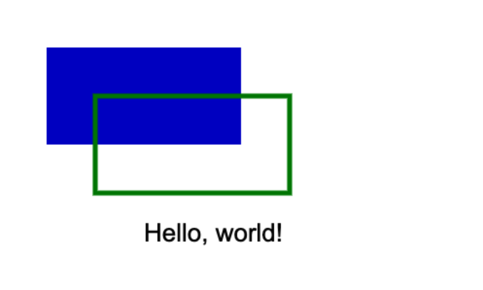

# Canvas for Jupyter

This small Python library allows drawing in Jupyter using the drawing Canvas. It acts as a bridge between Python and Javascript; for this reason, it's necessary to call the 'ctx.display()' function every time you want to process the drawing.

Here's an example.

### Example 0

```python
from CanvasContext import CanvasContext

# Create a canvas with an identifier "cnv0" of 500x300 pixels
ctx = CanvasContext("cnv0", 500, 300)

ctx.save()

# Draw the white background
ctx.fillStyle = "white"
ctx.fillRect(0, 0, 500, 300)

# Draw a filled rectangle at position (50, 50) with dimensions 200x100
ctx.fillStyle = "rgb(0, 0, 200)"
ctx.fillRect(50, 50, 200, 100)

# Set the stroke style to green and draw a rectangle at position (100, 100) with dimensions 200x100
ctx.strokeStyle = "green"
ctx.lineWidth = 5
ctx.strokeRect(100, 100, 200, 100)

# Draw text at position (150, 250)
ctx.fillStyle = "black"
ctx.font = "26px Arial"
ctx.fillText("Hello, world!", 150, 250)

ctx.restore()

# Send drawing commands to the browser
ctx.display()

```



## How to use it

To use the library, you first need to import it:

```python
from Canvas import Canvas
```

Next, you need to create a CanvasContext object. In this object, you define the identifier of the Canvas where the drawing will be done, as well as the dimensions of the Canvas.

```python
ctx = CanvasContext("canvas", 500, 300)
```

**Note**: Keep in mind, in a Jupyter Notebook, if you repeat a canvas identifier, the drawing will appear on the first ouput (canvas) that was executed with that identifier.

Finally, to display the drawing, you need to call the 'display' function of the CanvasContext object.

```python  
ctx.display()
```
### Example 1

```python
from CanvasContext import CanvasContext

# Create a canvas with an identifier "cnv1" of 250x150 pixels
ctx = CanvasContext("cnv1", 250, 150)

ctx.save()

# Draw the white background
ctx.fillStyle = "red"
ctx.fillRect(0, 0, 250, 150)

ctx.restore()

# Send drawing commands to the browser
ctx.display()
```


## Variables

Variables require special handling.

First, they need to be declared with 'addVariable', and to modify their value, you can use 'setVariable'.

Some things should be kept in mind:

- Within text strings, they can be used directly with the notation \$\{ \}

- When wanting to perform operations, the expression also needs to be placed within a text string using the notation \$\{ \}

- When getting values from context, a parameter 'destination variable name' must be passed

### Example 2

```python
from CanvasContext import CanvasContext

# Create a canvas
ctx = CanvasContext("cnv2", 350, 200)

ctx.save()

# Draw the white background
ctx.fillStyle = "white"
ctx.fillRect(0, 0, 350, 200)

# Set text style
ctx.font = "18px Arial"
ctx.fillStyle = "black"

# Define 'a' variable
ctx.addVariable("a", 50)

# Draw text at position (a, 50)
ctx.fillText("ABC", "${a}", 50)

# Draw text at position (a + 50, 75)
ctx.fillText("DEF", "${a + 50}", 75)

# Change 'a' variable value
ctx.setVariable("a", 150)
ctx.fillText("GHI", "${a}", 100)

# Add 50 to 'a'
ctx.setVariable("a", "${a + 50}")
ctx.fillText("JKL", "${a}", 125)

# Get context values (text metrics)
ctx.addVariable("x", 50)
ctx.addVariable("text", "Hello, world!")
ctx.addVariable("metrics", "")
ctx.measureText("metrics", "${text}")
ctx.fillText("Width of '${text}': ${metrics.width.toFixed(2)}", "${x}", 150)
ctx.fillText("${text}", 50, 175)
ctx.fillText("<<<<", "${x + metrics.width}", 175)

ctx.restore()

# Send drawing commands to the browser
ctx.display()
```


## Extra functions

There are two extra functions that can be used to draw text on the canvas:

**drawWhiteBackground**: draws a white background on the canvas

**drawGridBackground**: draws a grid background on the canvas

*Note*: 'drawGridBackground' first calls 'drawWitheBackground'

### Example 3

```python
from CanvasContext import CanvasContext

# Create a canvas with an identifier "cnv1" of 250x150 pixels
ctx = CanvasContext("cnv3", 250, 150)

# Draw the white background
ctx.drawGridBackground()

# Save context after drawing the background
ctx.save()

# Draw a rectangle
ctx.strokeStyle = "orange"
ctx.lineWidth = 10
ctx.beginPath()
ctx.strokeRect(50, 50, 100, 75)
ctx.stroke()

ctx.restore()

# Send drawing commands to the browser
ctx.display()
```


## Get canvas size

This is an example of how to get canvas size:

### Example 4

```python
from CanvasContext import CanvasContext

# Create a canvas with an identifier "cnv1" of 250x150 pixels
ctx = CanvasContext("cnv4", 250, 150)

# Draw the white background
ctx.drawGridBackground()

# Save context after drawing the background
ctx.save()

# Add variables to store canvas width and height
ctx.addVariable("cnvWidth", "${ctx.canvas.width}")
ctx.addVariable("cnvHeight", "${ctx.canvas.height}")

# Draw a rectangle
ctx.strokeStyle = "green"
ctx.lineWidth = 10
ctx.beginPath()
ctx.moveTo(50, 50)
ctx.lineTo("${cnvWidth - 50}", "${cnvHeight - 50}")
ctx.stroke()
ctx.fillText("Canvas size: ${cnvWidth}x${cnvHeight}", 125, 50)

ctx.restore()

# Send drawing commands to the browser
ctx.display()
```


## Interact with JavaScript code

The way this library works, is by creating JavaScript code from every CanvasContext function call.

When 'ctx.display()' is called, the JavaScript code is executed, and the drawing is displayed.

This means that it's possible to interact with the JavaScript code, and modify the drawing.

Additionally, it may help in working with variables more easily.

### Example 5

```python
from CanvasContext import CanvasContext

# Create a canvas with an identifier "cnv1" of 250x150 pixels
ctx = CanvasContext("cnv5", 250, 150)

# Draw the white background
ctx.drawGridBackground()

# Save context after drawing the background
ctx.save()

# Insert JavaScript code directly
ctx.addJavaScript("""
var cnvWidth = ctx.canvas.width;
var cnvHeight = ctx.canvas.height;

var x0 = cnvWidth - 50;
var y0 = 50;
var x1 = 50;
var y1 = cnvHeight - 50;

ctx.strokeStyle = "#FF0000";
ctx.lineWidth = 8;

ctx.beginPath();
ctx.moveTo(x0, y0);
ctx.lineTo(x1, y1);

ctx.stroke();
ctx.fillText("Canvas size: " + cnvWidth + "x" + cnvHeight, 50, 50);
""")

ctx.restore()

# Send drawing commands to the browser
ctx.display()
```

